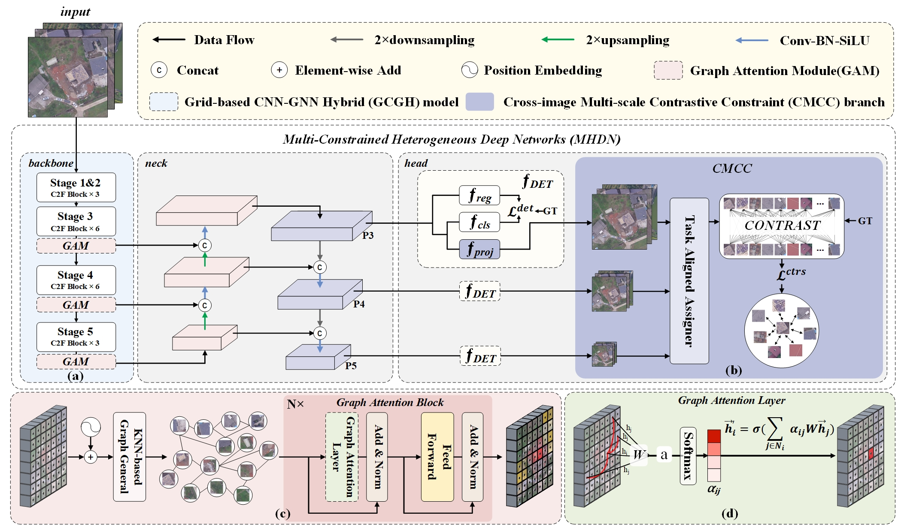

# Multi-Constrained Heterogeneous Deep Networks
⭐ This code has been completely released ⭐ 
<p align="center">  </p>

# <summary>PREPARE</summary>

## 1. Dataset
- Download data for our experiment from [baiduyun](https://pan.baidu.com/s/1glhitPRDya3Xcr0fAXXmxg) (code:9264) or [huggingface](https://huggingface.co/datasets/wong-dongxu/RSRBD). And the path of dataset is like that

```python
MHDN
├── dataset
│   ├── RSRBD
│   │   ├── train
│   │   │   ├── images
│   │   │   ├── labels
│   │   ├── val
│   │   │   ├── images
│   │   │   ├── labels
│   │   ├── test
│   │   │   ├── images
│   │   │   ├── labels
```
## 2. Install

```bash
pip install ultralytics
pip install -r requirements.txt
```
# <summary>USAGE</summary>

## Train

```python
python train.py 
```
## Val
You can use our pretrained checkpoints for test process.
Download pre-trained model and put it in [here](https://pan.baidu.com/s/1bKbbilwY7XUATcDEzSX1Eg?pwd=b8wy).

```python
yolo val model=MHDN.pt data=RSRBD.yaml
```
## Predict
```python
yolo predict model=MHDN.pt source='xxx.jpg'
```

# <summary>Acknowledgements</summary>
This code is built on [YOLOv8 (PyTorch)](https://github.com/ultralytics/ultralytics). We thank the authors for sharing the codes.

